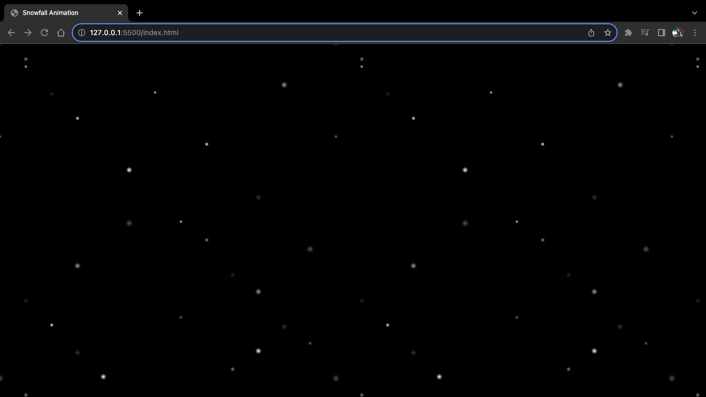

# Snow Animation Template

This is a simple template for creating a snowfall animation on a webpage using HTML and CSS. You can use it to add a festive and wintry touch to your website.

## Preview



## Getting Started

Follow these steps to set up the snow animation on your website:

1. **Clone the Repository**

   ```bash
   git clone https://github.com/BinuraThiranjaya1/snow-animation-template.git
